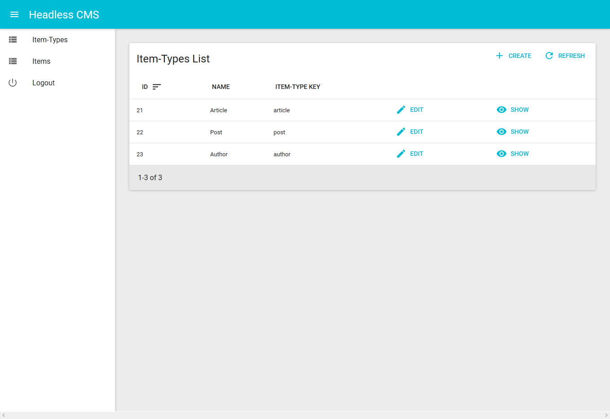
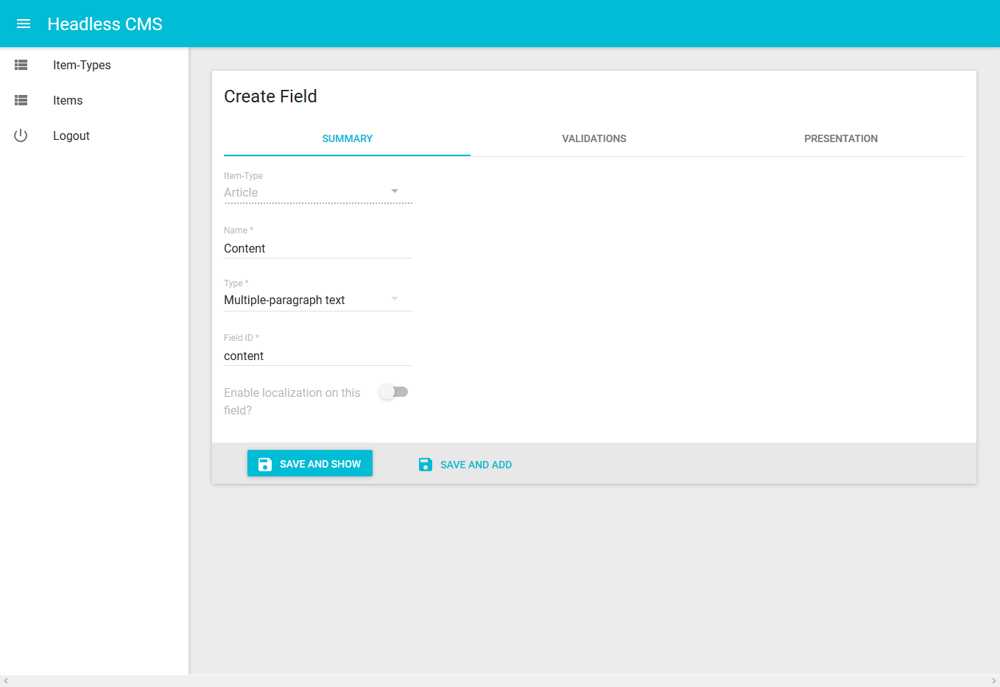
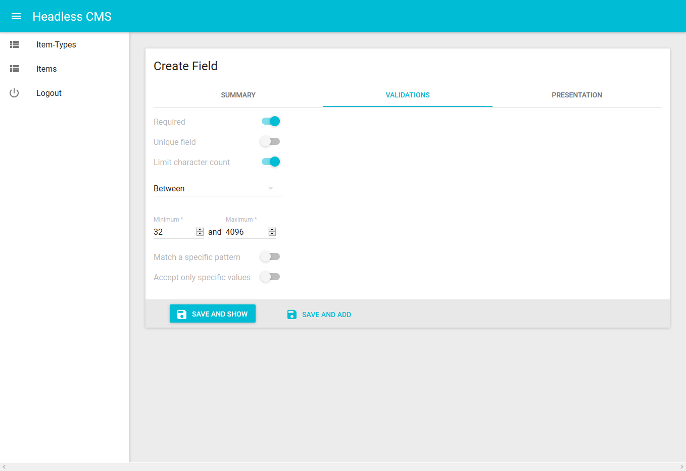
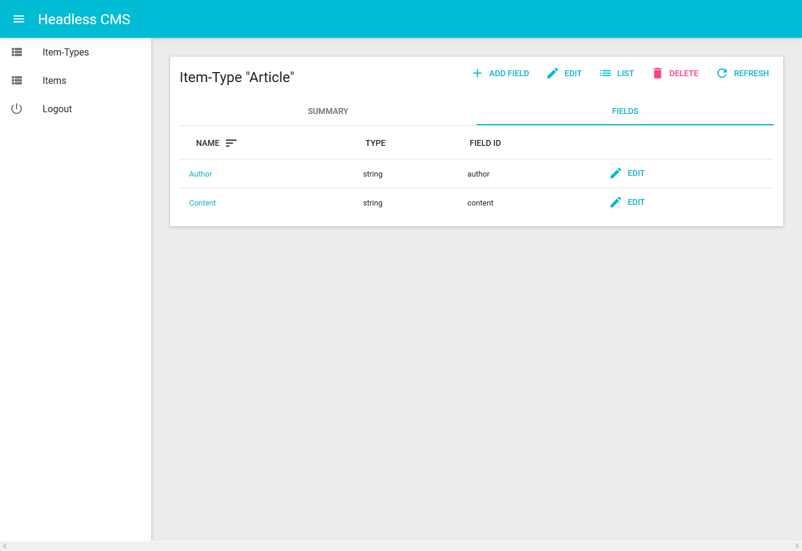

# Headless CMS Dashboard

This is a dashboard for [headless-cms](https://github.com/Xzya/headless-cms).

## Screenshots






## Running the project

Install the dependencies

```bash
npm install
```

Run the project

```bash
npm start
```

To build the project for production, run

```bash
npm run build
```
this will output the result to `build/`.

## Built using

- [React](https://reactjs.org/)
- [admin-on-rest](https://github.com/marmelab/admin-on-rest)
- [material-ui](https://github.com/mui-org/material-ui)
- [redux-form](https://github.com/erikras/redux-form/)

## License

Open sourced under the [MIT license](./LICENSE.md).